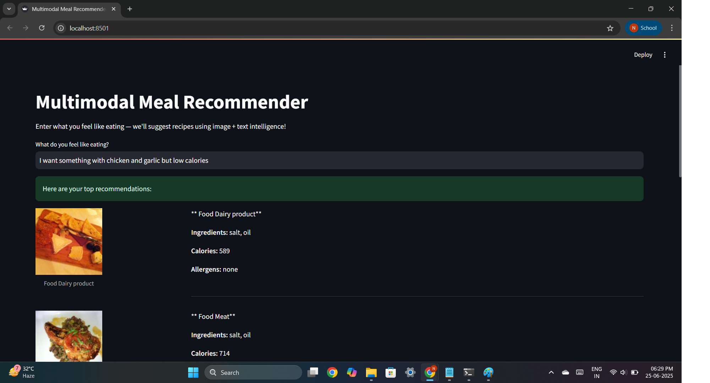
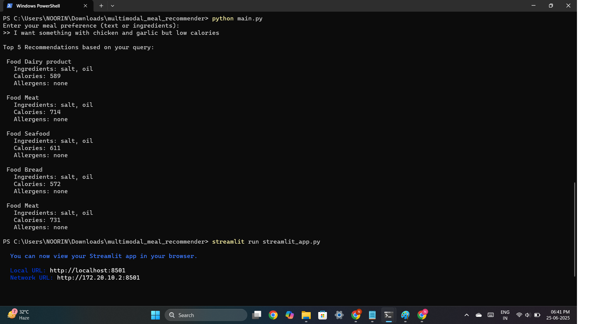

# 🍱 Multimodal Meal Recommender

> A smart food recommendation system powered by deep learning that understands your preferences from both text and images.

---

## 🌟 Overview

This project recommends meals by fusing information from:
- 🍲 **Food Images** (via ResNet50 or ViT)
- 🧾 **Ingredient Texts** (via BERT/MiniLM)
- ✅ Optional: **Speech Input** (via Whisper, not included in this version)

Whether you're craving "something with garlic and chicken, but low in calories" or browsing through healthy options, this system provides personalized, multimodal suggestions.

---

## 🧠 Tech Stack

| Modality | Model Used          | Description                                  |
|----------|---------------------|----------------------------------------------|
| Image    | `ResNet50` (Torch)  | Extracts 2048-dim food features              |
| Text     | `MiniLM-L6-v2`      | Encodes ingredients into 384-dim vectors     |
| Fusion   | `RandomForest`      | Combines embeddings for final prediction     |
| UI       | `Streamlit`         | Interactive interface for user input         |

---

## 📁 Project Structure

multimodal_meal_recommender/

├── data/ ← Recipe metadata & food images

│ ├── recipes.csv ← Main recipe data

│ └── images/ ← Recipe images (named <id>.jpg)

├── embeddings/ ← Precomputed image & text embeddings

│ ├── image_embeddings.npy

│ └── text_embeddings.npy

├── model/ ← Trained fusion model

│ ├── fusion_model.pkl

│ └── scaler.pkl

├── main.py ← Terminal-based recommender

├── streamlit_app.py ← Streamlit web app

├── train_fusion_model.py ← Training script for fusion model

├── extract_image_embeddings.py ← ResNet-based image embedding script

├── extract_text_embeddings.py ← BERT-based text embedding script

├── requirements.txt

└── README.md

---

## 🚀 How to Use

### 1️⃣ Install Requirements

bash: pip install -r requirements.txt

### 2️⃣ Prepare Dataset

You can use a real food dataset like:

Food11 Dataset on Kaggle Or generate your own 

### 3️⃣ Extract Embeddings

bash: 
python extract_image_embeddings.py
python extract_text_embeddings.py

### 4️⃣ Train Fusion Model

bash: python train_fusion_model.py

### 5️⃣ Run the Recommender

bash: python main.py

streamlit run streamlit_app.py

Example Query: I want something spicy with chicken and garlic, low in calories

It will return top matching meals based on semantic understanding of ingredients + visual content.

## 💡 Future Improvements

- Add real user preference profiles
- Use ViT instead of ResNet50
- Integrate Whisper voice input
- Add calorie/allergen filtering in UI

## 📸 Demo Screenshots

### 🖥️ Streamlit Web App

---

### 🧾 Terminal Output

## 👩‍💻 Author:
Noorin Nasir Khot

